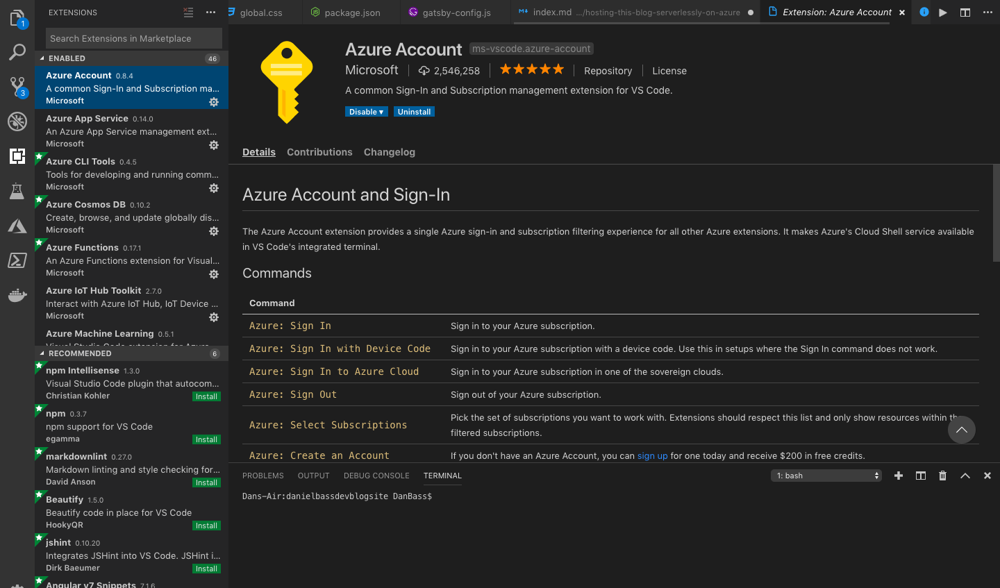
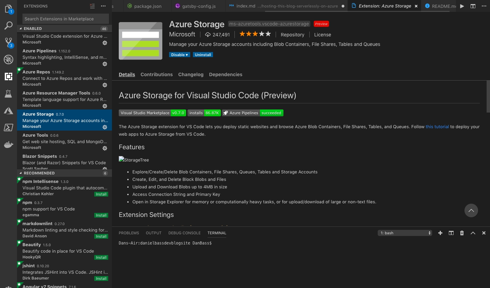
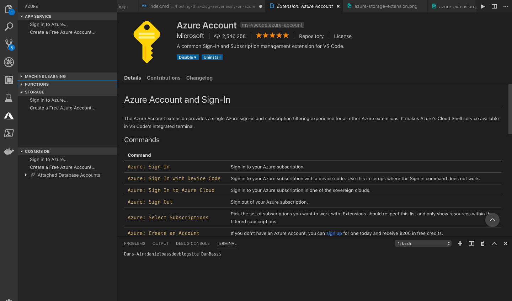
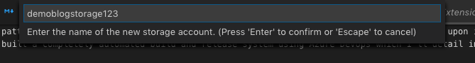
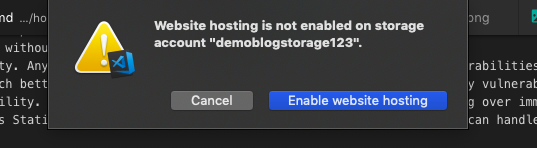
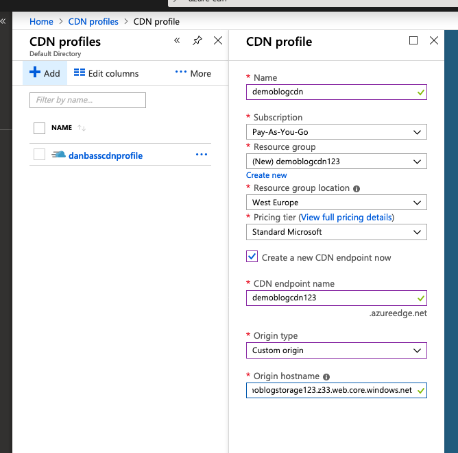
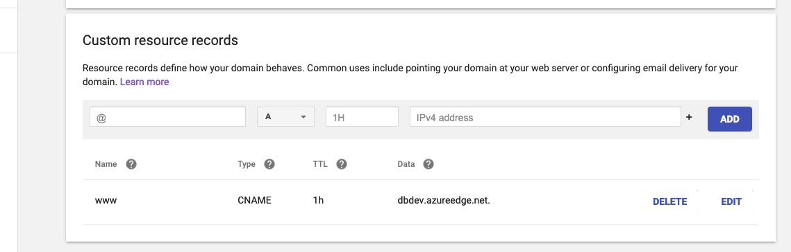
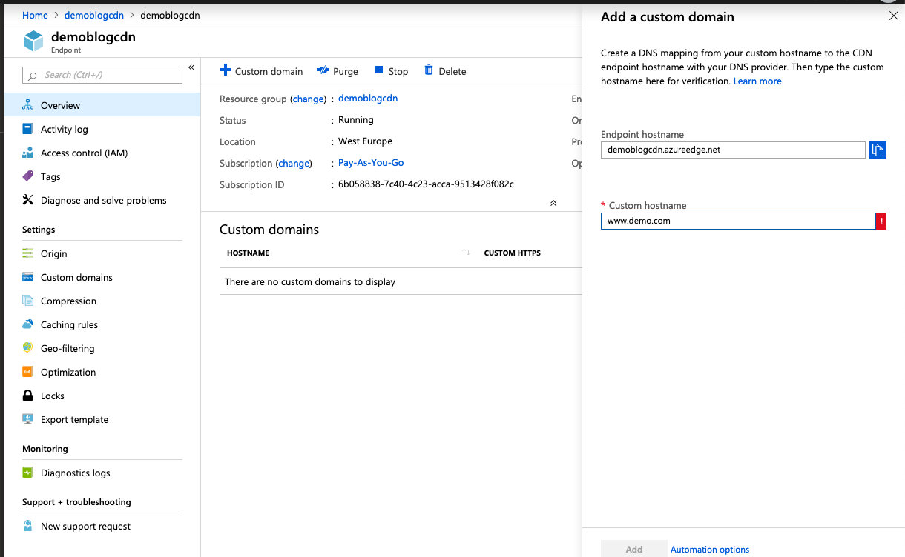
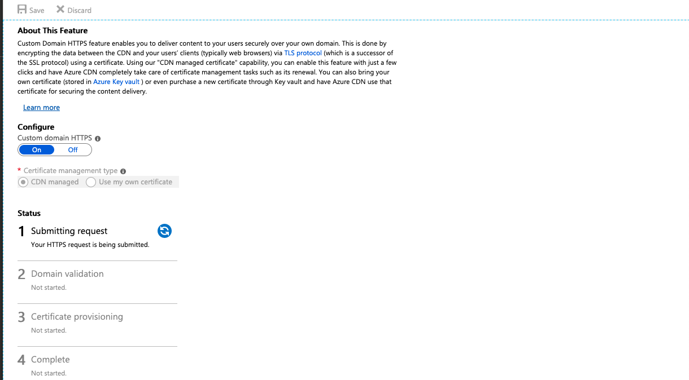

This is the story of how I hosted this blog and the serverless pattern that I used which you can use to host your own static sites on Azure for pennies a month (this blog actually has so far rounded to zero in terms of costs so far). This basic pattern can be extended into a more complex serverless architecture, which I'll expand upon in further blog posts. I've also built a completely automated build and release system using Azure DevOps which I'll detail in another post. 

## Why would you host your blog serverlessly? 
There's a range of practical reasons for doing this - and no its not marketing guff. I'll take what I think are the top 3 for your individual blogger:
1. Cost. So far the bill for this blog has not reached 1 penny in hosting - the only 'major' cost has been the domain. This is pretty impressive compared to most options - you can only usually get free hosting with severe scaling and customization limits or without custom domains.
2. Security. Any given Wordpress server is a smorgasbord of security vulnerabilities - most Content Management Systems aren't much better. A serverlessly hosted static site has no major security vulnerabilities outside of your Azure login. 
3. Scalability. When you make the big time you don't want your blog falling over immediately with all of the traffic. Serverless Static Sites have virtually no traffic restrictions - if Azure can handle it, your site can. 

These reasons also neatly line up in opposite order for bigger companies reflecting their different priorities - with the addition of speed of development compared to enterprise CMS platforms.

## What do I need before I get started? 
* Static site to host - that is a collection of html,js and css files. Mine is built using gatsby, but just plain html is fine too. 
* Azure Account
* VSCode - This can be done with any text editor, but I make prodigious use of the azure extensions as they speed up my workflow a lot so this guide will be in VSCode

### Step 1 - Set up VSCode
Download the Azure and Azure Storage Extensions for VSCode by visiting the Extensions tab and searching for them: 

You will now have a new tab on the left with the Azure logo. Click on it and you will see a section called Azure Storage with 'Sign in to Azure..' on it. Click Sign in to Azure and sign in. This will allow you to use VSCode to instantiate resources in your Azure Account. 

### Step 2 - Upload your site to a storage account
Before starting this step, you will need to run the build process, if any, that generates your static site. Click the upload icon on the Azure Storage. The extension will give you the option of uploading to an existing storage account, but for this demo we'll create a fresh one. These accounts are charged per data ingress/egress and data storage - so creating one costs virtually nothing (should literally cost £0.00)

Create a new Resource Group with the same name and deploy it to an Azure Region close to you. I deploy mine to West Europe or UK South. 
You then will be prompted to switch on Website hosting. This is because the Azure Storage Accounts are actually used for a range of other things, and website hosting is a relatively recent feature. 

You will then be prompted to set the index and error documents and select the folder to upload. If you don't have an error page you don't need to define it, but you do need to define an index (home) page and a folder to upload. Select the folder containing your static site. Click the browse button that appears in the bottom right. 

Your site is now online! However there's a few vital gaps (as highlighted by Mikhail Shilkov). Firstly, you probably don't want an ugly url with 'z33.core' whatever in it, you want a custom domain that you've purchased. Secondly, with that custom domain you want HTTPS encryption. Thirdly you want to connect a CDN to your site to vastly improve it's performance, amongst other benefits. This is all eminently possible, and is in fact how this blog is hosted. 
As usual with cloud tech there's a few ways of doing this - namely using Azure CDN (which under the hood can be Akamai CDN if thats your preferred provider) or using Azure Front Door. I don't have experience using Azure Front Door yet, but it looks pretty interesting - more of an all-in-one solution with the inclusion of a WAF than Azure CDN. We'll focus on Azure CDN for this post until I've had a chance to experiment with Azure Front Door. 

### Step 3 - Create an Azure CDN account
Open the Azure Portal and search CDN Profiles. Create a new CDN Profile and fill in the values as shown in the screenshot. You basically want to name and deploy the instance, and create a CDN endpoint. This CDN endpoint serves as a globally distributed access layer to your static site. It means that if a user in australia requests that endpoint, rather than the request going all the way to the West Europe Storage Account, its served by a CDN Point of Presence near them - reducing latency. This is a vital service for most sites, and is also required for enabling custom domains with HTTPS. 

### Step 4 - Map your Custom Domain to the CDN Endpoint
There's a way to do this mapping without interrupting traffic to a production endpoint, but I'm not going to cover that. Go to your domain name provider, mine is google domains. Add a CNAME record pointing at the CDN endpoint url (NOT the storage account url), as shown in the screenshot: 

Then navigate to your CDN endpoint in the portal and click add custom domain, as seen in screenshot. Enter in the domain you just mapped using the CNAME record. Note the www.

You can now attempt to access your site, but you may see some issues that will make you unhappy to ship this to production. When you attempt to visit the site from www.yourcustomdomain.com you will get a massive warning screen about dodgy SSL certificates. This is because the certificate used to authenticate the domain is the Azure CDN one, not one registered to the custom domain. They don't match and the browser knows it so it warns you. 

### Step 5 - Configure HTTPS on your custom domain
Go to the custom domain entry on the Azure CDN in the portal and click on it. It will have one button, to enable Custom Domain HTTPS. Choose the 'CDN Managed' Certificate (unless you already have a certificate of course). This will let azure manage all the details of obtaining the certificate, for nothing more than the usual per-usage costs of Azure CDN. Your custom domain HTTPS will then start going through a relatively slow process of being enabled as the service verifies your ownership of the domain and obtains a certificate. This should be painless as you already have a CNAME record pointing at the CDN endpoint, which effectively verifies that the owner of the domain is happy for the CDN endpoint to be verified. This can get painful otherwise, as the service will attempt to email the owner - but most people have identity obfuscation when they get a domain. It works out, but I did have a few days of pinging emails back and forth when I made mistakes working this out the first time. 

Eventually your certificate will be provisioned and you are ready to go - you know it works because you're reading this right now!

Dan