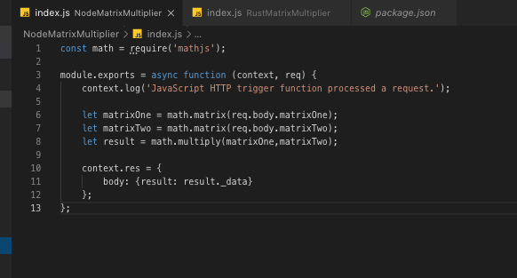
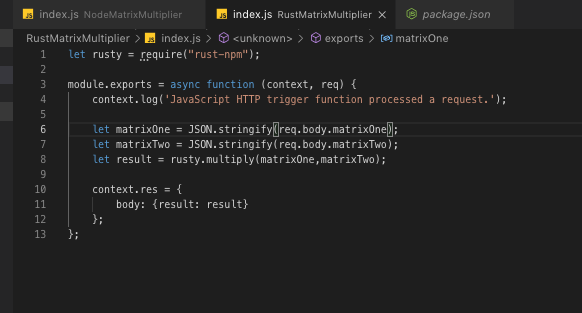
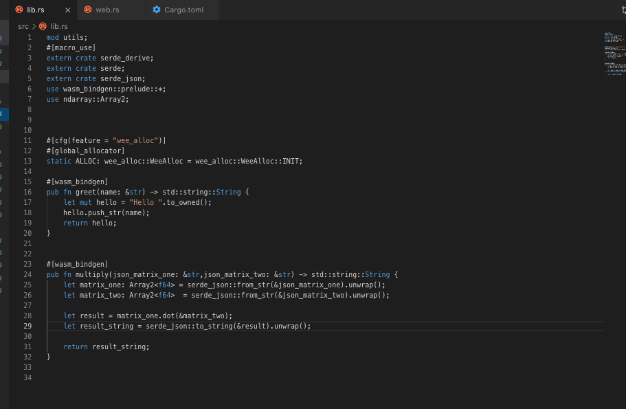
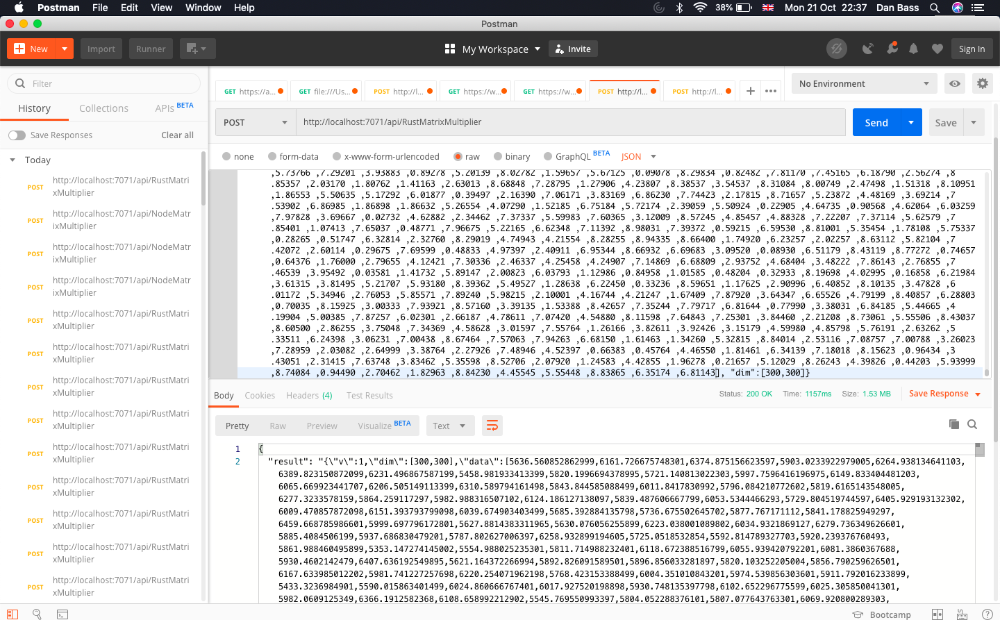

My previous article detailed a proof of concept showing how to use Rust on the fully supported Node.js Azure Functions runtime. This used WebAssembly - by compiling Rust to WebAssembly it was possible to execute it from Node.js. One thing I didn't mention there is that in principal every language can be compiled to WebAssembly, which means this demo would allow you to bring any language you like to Azure Functions. I've done some further work on seeing whether there was any point in this beyond allowing you to use whatever language you like, namely if there were any performance improvements. 
The test I created was pretty rudimentary, and probably riddled with flaws to developers with much better experience in performance testing, but I hope instructive. This test makes heavy use of libraries - the test is intended to demonstrate differences available to your average application developer. I'm sure advantages could be gained by handcoding the implementations to optimize them, but realistically most app developers aren't going to do that. 
I created two functions, both of which implement a matrix multiplication. One of them is done in normal Node.js with the very popular Math.js library. The other is done with a pass through straight to Rust, using the ndarray library. Math.js uses a different format to ndarray by default, and to minimize reformatting cost I just left them to pass as straight through as possible. 
### Code Examples
First of all the Node.js function: 

This simply loads two nested arrays into the Math.js library and multiplies them and then returns them to the user. This is the undoubtedly simpler function, and is pretty self-explanatory.
Next the Rust function. This comes in two parts, the Node.js wrapper function and the Rust function itself. Firstly the Node.js wrapper, which is similiarly simple: 

This takes in the two matrices, restringifies them as there are no WASM bindings for ndarray (or none that I could find) so Rust will be doing the deserializing internally, i.e. taking in a json string and converting it into a matrix. It uses the multply method exposed by the rust-npm package. The Rust function is a bit more complex: 
Starting at line 24, we've got the method declaration. The method takes in two string arguments, which are json encoded matrices, and one string response which is also a json encoded matrix. Lines 25 and 26 are using the serde library to deserialize json objects to ndarray matrices. Line 28 is the key part, using the ndarray to multiply the arrays together. Line 29 serializes the resulting matrix into a string before returning it. This looks simple, but was quite difficult to get to - probably as a direct result of my lack of experience with Rust more than anything. 

### Performance Results
So what are the results of this? As I stated in my previous blog post I'm expecting the performance of the Rust function to be better, albeit with some overhead from calling to a seperate runtime. So maybe something like for a small matrix the Node function would be marginally faster and then Rust would be faster for larger matrices. Firstly the larger matrix, which is a 300 by 300 random dense matrix of decimals. Firsly, the Node.js results: 
 
These show that the Node.js function takes around 3.2 seconds. 

Next the Rust results: 

This is a marked difference, almost 3 times faster in Rust! This was much more of a speed-up than I was expecting, with zero optimization and no multithreading whatsoever. This could save a fortune at scale in FaaS costs. I checked the memory usage on my laptop, the functions runtime when the empty 'hello world' function is called uses around 40mb, 122mb when the Rust function is called and 126mb when the Node function is called. Perhaps for more complex functions where the data will actually have time to be dropped in and out of memory we would see more of a difference here for Rust to basically flex its advantage over the Node garbage collector. As it is I doubt the garbage collector is even being called before the response is sent. 
A small 2 by 2 array should test the theory of the overhead of Wasm having an impact, firstly Node.js results: 
 

and Rust results: 

Both come in at 9ms, with averages hovering around 10ms - this blows the theory out of the water completely. Either the code I've written is so much worse in javascript that it is masking the difference - but with a 9ms response time I find that unlikely - or there's no significant loss calling into WASM for this use-case. This sort of makes sense here now that I think about it. Rust does not have a runtime like  Java or C#. So when it's compiled to WebAssembly, the only code created is the code you've written - whereas Java or C# has to generate WebAssembly, and execute that before any business logic is run, for their entire virtual machine. So from the Node.js runtimes point of view it is getting simply two different native sets of instructions that simply tell it to carry out business logic - one formatted as javascript, one formatted as WebAssembly. 

### Conclusion
Using Rust has a distinct performance improvement over Javascript, even without exploring multithreading. It doesn't even suffer at smaller payload sizes where you might expect the overhead of using WASM would cause a lag. If you have performance critical Azure Functions which are CPU-bound (i.e they aren't just waiting for network requests, they are genuinely trying to carry out calculations) then Rust could be a valid way to speed them up. 