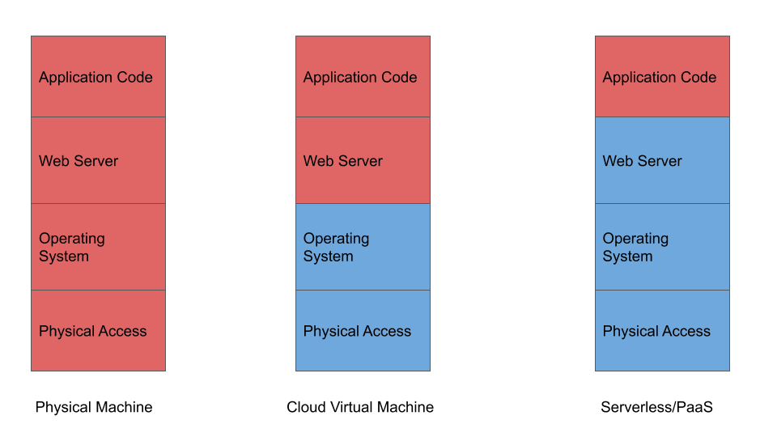
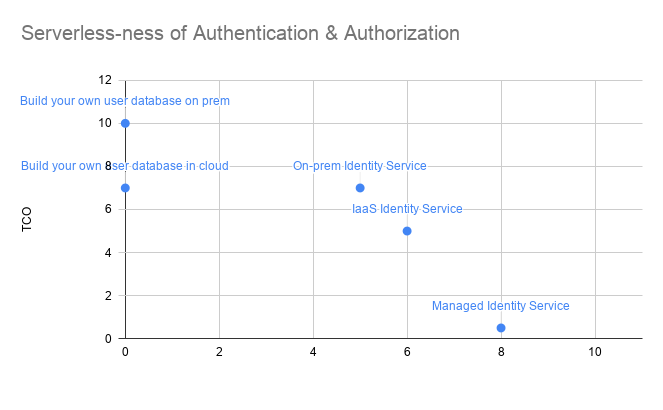

Security in Serverless is a tricky subject. It's commonly the first place in a large company where your serverless efforts will hit into issues. This is funny really because Serverless is a net benefit to security, and in fact embodies a lot of best practices that security professionals would appreciate. 

## How does Serverless Security work?
Serverless components like FaaS (Function-as-a-Service), Static Site Hosting on Storage or managed databases allow customers to simply provide code and don't expose underlying system details. The providers take ownership and responsibility for everything except your code. This is superb from a security point of view, because as part of this they take responsibility for keeping the entire platform secure. This means that a customer only has to keep their own code secure. To illustrate this, I've drawn up a diagram of the different levels of responsibility for different hosting models, red is managed by the customer and blue is managed by the provider:

What does this really mean in practice? Well when you choose something towards the left of this diagram you are betting that your company, be it a pet shop in Rotherham, a massive multinational bank, or a charity in Detroit is better at handling the technical details of keeping infrastructure secure than a cloud provider who's entire business and reputation depends on the security of it's platform. I'd strongly suggest this is a bet that you will lose - and unfortunately the loss of that bet can be catastrophic. 
So Serverless components tend to have a more secure platform. But how do we handle authentication and authorization? First of all I should explain those terms: Authentication means verifying who someone (or a system) is and authorization means determining whether that person (or system) has the right to access a app. You'll notice I mentioned system. What I mean by this is that you not only need to verify if people are who they say they are, but if your application is receiving data from another service, then you need to know that system is the system you expect - otherwise someone could send you messages pretending to be that system to trick you. 
This might sound abstract, but imagine transferring money to a friend using your online banking. You don't send money directly to each other. Your bank verifies that you are who you say you are and that you have the right to send money from that account. Your bank then tells your friends bank that they want to send them some money. Your friends bank then credits their account. It's super important that your friends bank can verify who your bank is, otherwise you could claim you were sending lots of imaginary money to your friend.
So we need to solve two problems, authorizing/authenticating end users and authorizing/authenticating systems. Like any problem there's lots of ways to solve it so it's now time to use my TCO/Focus chart again.

Realistically as an application developer you want the system that you choose to get out of the way - it's not the key part of resolving your user experience and your users simply expect it as standard. You also can't afford to take any risks with these systems - a failure will be catastropic, with user data leaked to external attackers. Once again, deciding to develop your own login system is deciding that your company, the aforementioned pet shop in Rotherham, is better at security than companies who's entire business model relies on providing an identity service. This, to me, is catastrophically risky - and this is proven by the vast number of breaches which turn out to be because of details like user passwords being stored as plaintext, or the database having a critical security vulnerability or simply no password. If you decide to use a service (please do) then you can decide to either host this yourself, or use it a managed fashion. I'd prefer to not run my own service only to have someone hack the underlying virtual machine - so it makes sense to use a manageed service. This is also the solution with the least faff. If you're on Azure, this is either Azure Active Directory (for employee login & system login) or Azure Active Directory B2C (For end customer login). 

A quick aside: There's other strong benefits from a GDPR/data privacy point of view here. AAD B2C (words can't express what a terrible service name this is) will allow your users to set up an account, or use a social provider (login with facebook etc), enter in personal information like addresses or phone numbers that you need, and then provide you with an anonymous identifier. You then look up that personal information when you need it, rather than storing it in your own systems. This is a dream for end user security, and allows you to make it possible for your user to strip all of their info from your systems at the click of a button (so long as you don't make a copy).

## Serverless Security Architecture
