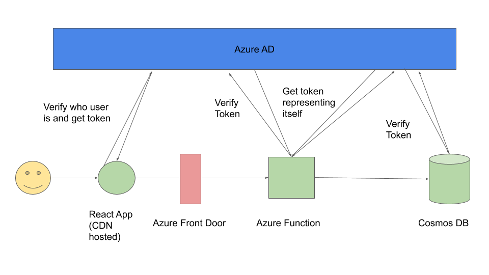
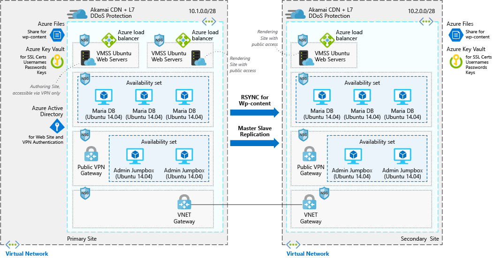

Security in Serverless is a tricky subject. It's commonly the first place in a large company where your serverless efforts will hit into issues. This is funny really because Serverless is a net benefit to security, and makes creating secure applications easy enough that developers will actually do it. 

First of all, let's take a look at an example secure serverless architecture: 

This is complex - because doing security is inherently complex. First of all, the flow. The React App relies on a Managed Identity Service, in this case Azure Active Directory, to verify the user's identity by asking them to log in. It then gets a token which effectively represents that user for a small period of time (i.e this token does expire, it's not permanent). It then calls an Azure Function with this token. The Azure Function then leans on the same Managed Identity Service to verify the token and verify that the user has access to the Azure Function. It then gets its own token to prove its own identity from Azure Active Directory and calls the database with that, before finally the database verifies this token for veracity and access. 

That seems really complicated to set up, but because it uses managed services, it mostly boils down to a few lines of config and some boilerplate code to retrieve tokens. Can you imagine how hard it would be to create this without managed services? You would have to create a user database and secure that (probably nothing to do with the actual problem you're trying to solve) and create a method of creating and verifying tokens. You'd then have to come up with some kind of database of all of your services as well. So what developers end up doing instead is using static connection strings/keys which, if stolen, give complete access forever - but the chance of them being stolen can be kept very low quite easily.

There's another component on this diagram called 'Azure Front Door'. This product provides a number of services, however in this case we are using it for it's Web Application Firewall (WAF). What a WAF does is monitor activity to your application and look for suspicious activity. It'll do things like block someone trying to flood your site with too much traffic (known as a Distributed Denial of Service attack), spot attempts at probing the backend for weakness and block them and block more sophisticated hacking attempts like SQL injection or attempts to break into the underlying servers. Again, imagine trying to build this yourself - this requires massive teams of security professionals and a heavy dose of Data Science. Using a managed service makes sense unless you are literally Symantec or Norton. Handily, because it's a managed service, this can be implemented with solely config - which once done once can be copied and pasted between projects. 

Finally there's an element on the diagram that hasn't been explicitly called out. Serverless components like FaaS (Function-as-a-Service), Static Site Hosting on a CDN or managed databases allow customers to simply provide code and don't expose underlying system details. The providers take ownership and responsibility for everything except your code. This is superb from a security point of view, because as part of this they take responsibility for keeping the entire platform secure. This means that a customer only has to keep their own code secure. To illustrate this, I've drawn up a diagram of the different levels of responsibility for different hosting models, red is managed by the customer and blue is managed by the provider:

Looking at this architecture, and all of the information I've laid out, I'm completely confident in it's security - and you'll have noticed there's not one firewall, IP whitelist or fiddly VNET in it. I'm so confident in fact that I have built this architecture, and am hosting it [here](INSERT LINK), with the source code completely open source [here](INSERT LINK). I'm storing a secret message in the database - let me know what it is and colour me impressed. 
## 'Traditional' secure cloud architecture
So let's compare this against a traditional secure cloud architecture; in fact why not use one of the examples Azure itself suggests you use, [here](https://docs.microsoft.com/en-us/azure/architecture/example-scenario/infrastructure/wordpress). I've got the architecture diagram here for convenience: 

Now this application is a Wordpress install, which is inherently a bit more complicated than the app above. Wordpress is a content management app, designed for normal humans to build websites - it has a backend which your site authors login to and a public endpoint that customers visit. But I think anyone would agree this diagram is quite complicated. The app has a master slave arrangement, with both being in their own private virtual networks. Inside each there are three sets of virtual machines. The advantage of the virtual network is that the whole internet can't get in, only a finely controlled region of IP addresses. It's using Azure AD for user login, which is great. 
I have a number of issues with this architecture:
* It's very complicated. Very little of this architecture has anything to do with the underlying problem of allowing people to make their own websites. 
* The running cost of this architecture when no-one is on it has got to number in a minimum of hundreds of pounds a month - bearing in mind that you are likely to need at least one copy for a testing environment.
* The list of vulnerabilities on those Ubuntu 14.04 Virtual Machines makes for [grim reading](https://www.cvedetails.com/vulnerability-list/vendor_id-4781/product_id-20550/version_id-178595/Canonical-Ubuntu-Linux-14.04.html)
* You have to keep patching your database and your Wordpress install on each one of those virtual machines - if you miss a single one or simply don't apply it fast enough then you will be in trouble
* Using a Virtual Network with a limited IP range restrains you from using any Serverless compute platforms - and any time you put a workaround in to allow you to do so you are effectively exposing your application to the entire internet, rendering the limited IP range mostly pointless. 
* There's no Web Application Firewall - of course you could add one and add even more complexity. 

