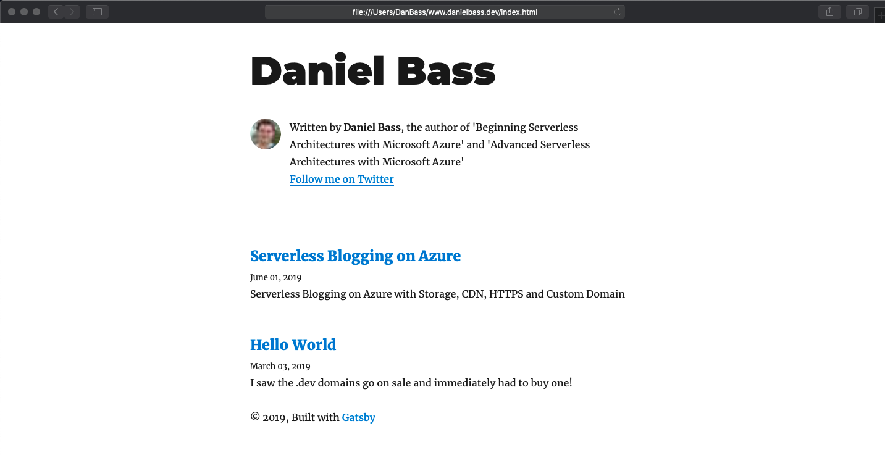

This is just going to be a short post before I start another one on adding Application Insights to this blog to see how many hits I am actually getting. Off the back of my previous post I had some questions about how you could effectively migrate a site to this solution - the full answer as usual is 'it depends'. 
I could go on about all of the different conditions and tradeoffs here all day, particularly with Content Management Systems, but lets get into my simple serverless site migration.
### What do you need?
* The previous article on my blog
* macOS/Linux or the Windows Subsystem for Linux (find how to install [here](https://docs.microsoft.com/en-us/windows/wsl/install-win10))
* wget. Install instructions vary per platform - I use macOS so i used the command `brew install wget`
* Url of the site you want to migrate
* (Optional) VSCode

### Steps
1. Look up [wget](https://www.gnu.org/software/wget/). This is the simple tool we'll be using. Open up a terminal and enter the following command:
    ```shell
    wget --mirror --convert-links --page-requisites --no-parent  https://www.danielbass.dev
    ```
2. You will now have a folder called 'www.danielbass.dev'. Open it up and take a look around. I'm using VSCode to make it easy. Now what have you got here? Well what wget has done is do a recursive pull of every asset served up by this website as seen by a client browser. This works with a static site like mine, or with some fancy CMS - they all eventually have to serve up HTML no matter how clever they are. It's also modified all of the links so they no longer point to the deployed site and instead point locally (please note I've had some trouble with the reliability of this, so worth a double check)
    
3. View the index.html file in a browser. I was getting some bizarre behaviour from the latest build of Firefox Developer Edition, but worked fine in Safari. You'll see the entire site as though it was on the internet, but on your local machine - complete with working links. 
    
4. Deploy this folder in the same way as described in my previous blog post.

### Problems/Considerations
This is by no means a silver bullet, and has many issues. But if you are stuck on expensive or vulnerable hardware, it could get you out of the sitatuation quickly. 

The biggest issue is the immediate stopping of any 'server side' functionality, or plugins that depend upon it. This can include comments sections, product catalogues or payment systems. This would either need to be accepted (just display a temporarily out of order sign) or mitigated (reproduce the functionality in static code)

Another is ongoing maintenance of code - you may possibly now have hundreds or thousands of HTML files that are all the product of a few simple template files on the CMS side. This is fundamentally unmaintainable from a code point of view. This is mitigateable with work - I use a static site generator called [Gatsby](https://www.gatsbyjs.org/) which lets me use React components to generate HTML pages. I write all of my posts in markdown and Gatsby passes them through react components to generate the HTML. Theres a range of static site generators available, so maybe one supports your particular templating language. Another approach is to use a headless CMS - but they don't tend to be very serverless (yet) and can reintroduce the very issues you were trying to escape (security, scalability, price).

Finally, ongoing maintenance of content. You've esacaped the CMS... now how do your non-technical users manage content? There's a range of mitigation's here, but they all basically rely on static site generators or headless CMS. Consider the Gatsby example above - would it be possible to teach your editors to use markdown? Would it be possible for them to use a simple git client like TortoiseGit etc? In this way you could have your content editors simply edit the markdown like developers would. This might be completely impossible, but is often overlooked. If a CMS is necessary then there's a few which now play nicely with static site generators by making commits to your GitHub etc whilst providing a nice UI: [Netlify](https://www.netlify.com/) and [Forestry](https://forestry.io/). 

This method can work as a good start to a migration however, and start to make people think differently about how websites, particularly content-driven ones, need to be hosted. 