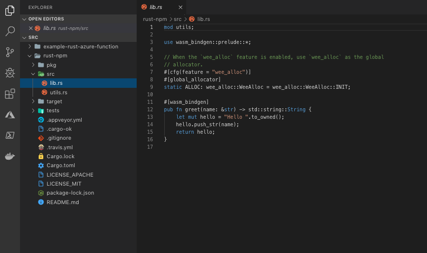
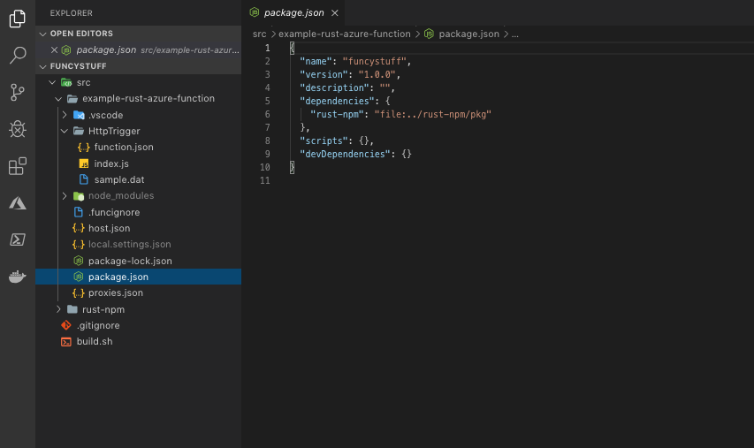
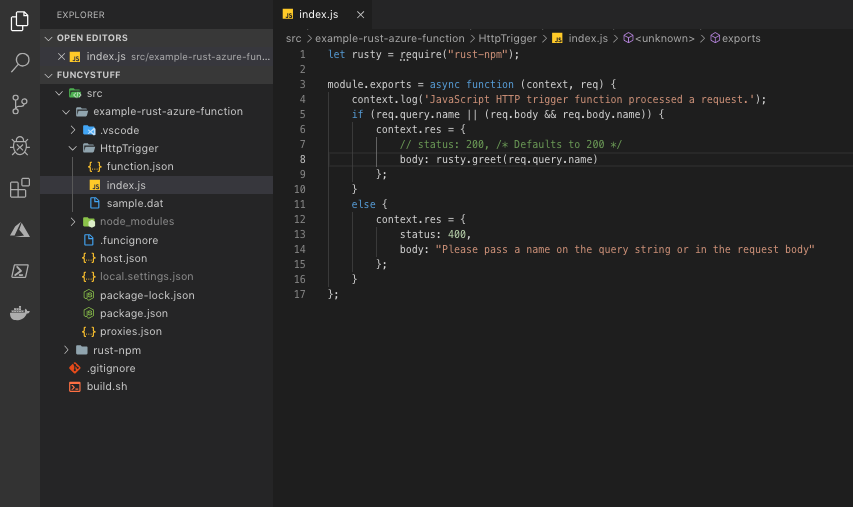

For the past few months I have been very interested in a relatively new language, Rust. For those of you who haven't heard of Rust, it is a new systems programming language which promises the performance of C and C++ without the horror and Segfaults. It uses a cool way of managing memory that's unlike anything else - in C/C++ you have to do this manually (which is difficult to get right but very efficient if done well) and in languages like C# or Java there's a garbage collector (which is much easier to get right, but adds overhead). Rust chooses a third path, using the concept of ownership. I'm woefully unqualified to explain the details - I'll leave that to the fantastic [Rust book](https://doc.rust-lang.org/book/ch04-01-what-is-ownership.html).

So Rust is super fast. The great part is the innovative memory approach, along with great language design (as far as I can tell, being a beginner) means its also ergonomic and productive. It's the number 1 language developers wish they were working with. In a serverless context this starts to get very interesting - if I can produce working business value at the same speed in this language as I can in other higher-level languages like C#, Javascript and Python (Bearing in mind I take a holistic view of business value - so including downtime, bugs etc), but with a vastly better memory footprint and raw speed, then I could significantly drop my serverless bill. As Azure Functions are charged in Gigabyte seconds - a measure how much RAM you use and for how long - a language with a much lower memory footprint and faster speed should logically save money. Often this isn't really what you need to optimize, but humour me. 

Enough selling of how awesome rust is. Suffice to say, as a Serverless enthusiast, both at work and on home projects, I really wanted to use it on Azure Functions. To do this is tricky though, as it's not a supported language for Azure Functions - and frankly support across Azure is very poor. There is an unsupported project which works well written by [Peter Huene](https://github.com/peterhuene/azure-functions-rs). This relies on creating a Docker container with Rust and the custom Azure Functions rust sdk in it and hosting it on Azure Functions. The trouble I have with Docker-based solutions on Azure Functions is that I now have to maintain all of my Docker dependencies - it's no longer just bring your code. If there's a security vulnerability in one of my docker container dependencies that is my problem, not Microsofts, and a big part of the TCO (Total Cost of Ownership) benefit of Serverless is minimizing my exposure to such issues. If Microsoft are looking at adopting Rust as an official language though then I'd very much up for using this approach! 

So what can you do to get Rust working serverlessly? Well the Rust community is one of the most engaged with something called [WebAssembly](https://webassembly.org/). WebAssembly is a new compilation target for any language, most notably so far C/C++/Rust and C# (Blazor). This resulting compiled WebAssembly can then be run in the browser, in a similiar way to Javascript, but with potentially much higher performance - in fact the performance of WebAssembly is said to be near-native. V8, Chromes's Javascript engine, has full support for WebAssembly, and Node.js uses V8. So therefore you can use any language compiled to WebAssembly in a Node.js application. Node.js is a fully supported runtime on Azure Functions - so if we compile our Rust to WebAssembly and call it from a Node.js Azure Function we can use Rust in a fully-supported, patched and fast environment on Azure Functions. So how? 
## Install
[Node.js LTS](https://nodejs.org/en/)

Azure Functions Core Tools:
```shell
npm install -g azure-functions-core-tools
```
[Rustup](https://www.rust-lang.org/tools/install)

Rust Nightly:
```shell
rustup toolchain install nightly
rustup default nightly
```
[wasm-pack](https://rustwasm.github.io/wasm-pack/installer/)
## Process
if you just want the result to use as a template to modify, or just want to cheat and get to the end immediately, feel free to clone the repo [here](https://github.com/deepbass/azure-functions-rust-wasm). 
1. Create a Rust WASM project using Cargo: `cargo generate --git https://github.com/rustwasm/wasm-pack-template` and name it something
2. Open up your new Rust WASM project in VSCode (Other IDE's are available - it has a decent Rust extension though). It has a range of things in it, this isn't a Rust course so I won't go through all of them. The key bit is the lib.rs file. This has all the methods that your Rust code is going to expose to node. Modify your code so it matches the screenshot: 
3. Execute a build to generate a WASM project - `wasm-pack build --target nodejs`. If you take a look inside the newly appeared pkg folder you'll see a package.json file and some js and wasm files - everything you need for a npm package. You could publish this to npm if you wanted, but we are going to rely on a local reference for ease of use here. 
4. Navigate back up out of the rust project and use azure-functions-core-tools to create an Azure Functions project: `func init example-rust-azure-function --worker-runtime node`
5. Open the new example-rust-azure-function folder and create a HttpTriggered function: `func new --template "Http Trigger" --name HttpTrigger`
6. Open the new package.json file in VSCode. This needs to reference your local Rust project, but in a language it understands - so we are going to have to reference the pkg folder. Modify your package.json file to match the screenshot: 
7. Next we need to modify the HttpTrigger's code to reference the Rust code. Open the index.js in VSCode. Add a require statement for the package reference, and replace the line that concatenates the Hello Name with a call to the greet function, as shown in the screenshot: 
8. Run `npm install` and run `func host start`. Visit [http://localhost:7071/api/HttpTrigger](http://localhost:7071/api/HttpTrigger?name=Dan) - You'll see a message that's exactly the same as the message the HttpTrigger function shows by default.

##Conclusions
This is obviously a very limited demo, simply replicating the standard templated Http Trigger functionality. But with this approach, you could in principle write every single function in a Node.js function app in Rust, with only wrappers in Node. It'd be interesting to see as well whether the multithreading performance is improved - official advice is not to use it with Node on Azure Functions, but it may be that the Rust runtime will improve that. Please feel free to file issues or questions on GitHub or tweet me. 