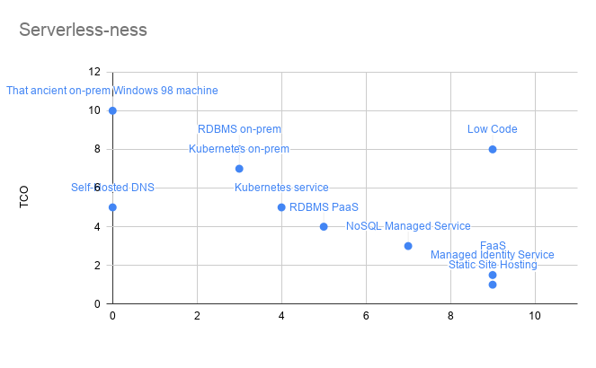
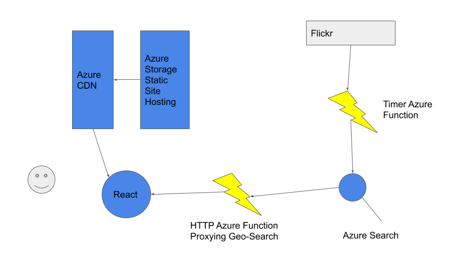

I've been writing for a little while about Serverless technology and evangelizing about it both at work and elsewhere. But the most common question I get asked is still "What is Serverless?" (Which is generally silently followed with "and why should I care"). 
This is a totally valid question, and generally the answer I give depends heavily on the audience. This is because people are generally looking for a one-liner to go away with, not an indepth evaluation of the framework used to evaluate how 'Serverless' something is. This post is my long answer that I wish I could give without boring people to death! 
## Serverless Mindset
The thing that I always say is with Serverless work is that you need to approach software development with a Serverless Mindset. What does this mean? It means approaching problems in a way focuses on the problem and maximizes total value. We're solving a problem, so lets focus on that problem and not extraneous details like what version of ubuntu the box under our desk is running. This is *INCREDIBLY* hard for intelligent people, we love details.
So how does this play out? Well you seek out tools that let you focus on solving business problems. Now before you panic that I'm going to introduce some awful low code tool with no source control, error handling or extensibility, don't worry. I said *total* business value for a reason! Those tools generally introduce deadful cesspools of technical debt which would *not* qualify. So we want tools that let us focus on business value, without being a nightmare to maintain. You could draw a rough graph here, so I did! 

On one axis we've got 'TCO' or Total Cost of Ownership. This is much beyond the ticket price of the infrastructure - this includes things like the wages of the person you have to retain who remembers how to update the thing, how many opportunities it prevents us from taking with it's limitations etc. On the other axis we've got 'Focus'. This is how effectively the product lets you focus on the actual problem you're trying to solve. This is generally poor for things like databases, which have all sorts of nonsense that is not related to your application trying to maintain state. One thing to point out here is to not take this graph too seriously - there will be things wrong with it and it has been used to illustrate a point rather than meticulously researched. 

There's a relationship between Focus and TCO here that you can observe. The more unfocused the product, the more time you spend solving problems that are technical rather than solving the actual problem you wanted to solve. This leads to a higher TCO as you are likely to need to carry out more maintenance on your solutions to these problems. 
There's also a clear cluster, that was in no way architected by me, in the bottom right with a high focus and a low TCO. These are the components I would rate as Serverless. As you fall down the trendline, these  products are less and less Serverless. Serverless is a poor name but you can see that more and more of the 'Server' (read extraneous technical details) is creeping in further down that trendline.
One thing to note is that to achieve the minimum TCO, some form of Scale to Zero and autoscaling must be possible. For those of you unfamiliar, Scale to Zero is where a product will charge you nothing if you are not using it, other than storage (Which you are inherently using constantly). It is quite rare for an application to be used absolutely constantly. Almost no apps at all will have a totally predictable and stable load pattern. Simply having to do planning for capacity at all itself increases TCO and reduces focus. You spend time planning, measuring and architecting for capacity which you could be spending on problem-solving, and without Scale to Zero you spend money on resources that you aren't even using.

## Serverless Architecture
Using a Serverless Mindset, you'll generally try and create a solution to a problem using a Serverless Architecture. A Serverless Architecture is an application architecture that places a priority on Serverless Components (Function-as-a-Service, Static Site Hosting, Managed Services etc). Notice that this is placing a priority, not using only Serverless Components. This is because not all problems are solvable with Serverless tech, astonishingly. Sometimes you need an application without any cold start at all or it will explicitly fail to meet its requirements (maybe high frequency trading etc). Using the methods detailed earlier, you can fall down the Serverlessness stack until you meet the requirement, whilst retaining the rest of your application at a maximum focus, minimum TCO. 

Let's look at an example. I want to solve the problem of photographers not knowing where to go to take cool photos. This is a real application I built which is running [here](https://www.vufinder.app). Here is the expertly drawn architecture diagram for this application. 

In this diagram you can see that a React application is served up by Azure CDN (Content Delivery Network). The CDN is seeded from files stored on Azure Storage. This React app then spins up on the clients browser and calls the Azure Functions backend to fill in the map view. The Azure Function queries a managed search service called Azure Search. This is currently on the free tier to save money for a side project. The index for all of the photos is filled in by every night an Azure Function calling the Flickr API. 
I've called this a Serverless Architecture, but those of you with an in depth knowledge of Azure will know one of these components doesn't quite fit the Serverless definition, namely the Azure Search. Azure Search is a managed search service which is great, but you have to choose different levels of throughput and it cannot scale to zero. I have been considering filling this in by create an Azure Function that implements Lucene (A Search Engine) using a storage account as the backing store, but that would involve very much focusing on things that are not the underlying problem. This reinforces what I've been saying about the Serverless Mindset. I'm willing to sacrifice an element of Serverless-ness in my app and an increase in TCO, because the fix would involve a significant increase in TCO itself as I'd have to develop and maintain thousands of lines of code implementing a replacement for Azure Search. My low-key bet here is that Azure will probably come out with a Serverless Search Service before long - they have much more of an interest than I do. 

## What can I, a developer, do with this knowledge
Firstly, approach your current and future work with a Serverless mindset. Even if you don't have the power to move to use some of the tools detailed here, simply considering the focus and TCO aspects of an architecture decision will benefit you greatly. Secondly, get comfortable with Infrastructure. Infrastructure components like queues, databases, caches etc are now much more important to know about and understand to deliver your application. If you aren't using Infrastructure as Code already I would strongly strongly suggest it. Finally I'd consider rewriting the architectures of some Apss you have built already into a more Serverless form and compare their TCO - particularly around scalability.

## So what is Serverless then? 
Again, it depends. But I often sum it up like this. Serverless is any service where I can just focus on the problem I'm trying to solve and send my code to the provider and let them care about every aspect of making that code available. This covers things like Function-as-a-Service (Azure Functions or AWS Lambda) or Static Site Hosting (Azure Storage or S3). It doesn't quite capture the nuances of TCO, but realistically getting into that debate is how I send people to sleep - which you've managed not to do if you've kept  reading this far. 

I hope you've enjoyed this, please feel free to get in touch on twitter or LinkedIn